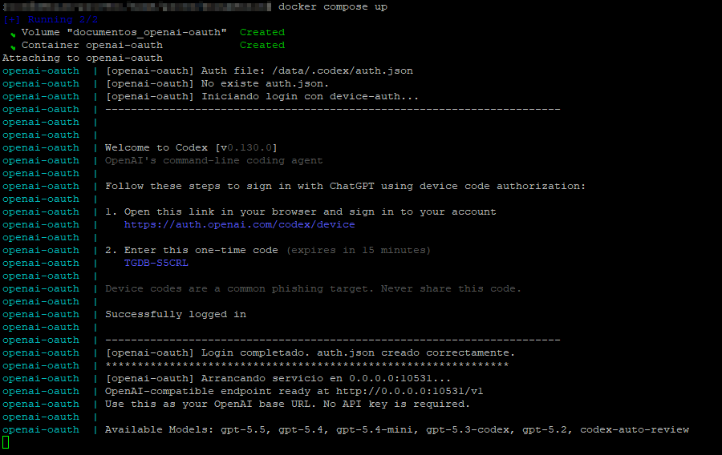
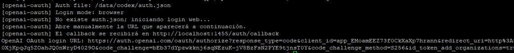

# openai-oauth en Docker

Imagen para ejecutar [`openai-oauth`](https://github.com/EvanZhouDev/openai-oauth)
con login mediante device-auth o navegador.

La imagen incluye Node.js 22, la versión más reciente de `@openai/codex`
disponible durante la construcción, `openai-oauth` 2.0.0, `curl` y los
certificados CA. `curl` es necesario para que `codex login --device-auth`
pueda completar el flujo de código de dispositivo dentro del contenedor.

## Inicio rápido

docker-compose.yaml
```yaml
services:
  openai-oauth:
    build: .
    image: ar0per0/openai-oauth:latest
    init: true
    restart: unless-stopped
    network_mode: host
    environment:
      LOGIN_MODE: device # Cambiar a "browser" para iniciar sesión mediante el navegador.
      PORT: 10531
      TZ: Europe/Madrid # Modelo usado por las pruebas cron y de inicio; vacío usa el primero de /v1/models.
      MODEL_TEST: "gpt-6.1-sol" # Modelo usado por las pruebas cron y de inicio; vacío usa el primero de /v1/models.
      CRON_TEST: "" # Varios horarios se separan con: 5 4 * * * | 2 4 * * *
      CRON_TEST_COUNT: 3 # Número total de respuestas OK consecutivas exigidas en cada ejecución.
      STARTUP_MODEL_TEST: true # Ejecuta las mismas pruebas al arrancar si auth.json ya existía.
      HEALTHCHECK_TIMEOUT_MS: 30000 # Tiempo máximo de cada petición de prueba, tanto cron como de inicio.
    volumes:
      - openai-oauth-data:/data/codex

volumes:
  openai-oauth-data:
```
docker compose up -d `crear + iniciar docker`

docker compose -f openai-oauth `ver logs`

Captura modo device:


Captura modo browser:


---

## Detalle

```bash
docker compose build --no-cache
```

Durante la construcción se comprueba que `curl`, `codex` y `openai-oauth`
estén instalados y sean ejecutables. El contexto Docker excluye archivos de
credenciales, `.env`, datos locales y dependencias de Node.

La imagen aplica además un parche de compatibilidad a `openai-oauth` 2.0.0
para aceptar imágenes OpenAI embebidas como
`data:image/...;base64,...` dentro de `messages[].content[].image_url`. Esa
versión convierte todas las imágenes en objetos `URL`, lo que hace que AI SDK
intente descargar también las URL `data:` y las rechace por no usar HTTP(S).
El parche entrega el contenido base64 y su tipo MIME directamente a AI SDK;
las imágenes con URL `http://` o `https://` conservan el comportamiento
original. La construcción falla explícitamente si el código de una futura
versión deja de coincidir con el parche, en vez de producir silenciosamente
una imagen sin soporte multimodal.

En `compose.yaml`, selecciona el método de autenticación:

```yaml
environment:
  LOGIN_MODE: device
```

o:

```yaml
environment:
  LOGIN_MODE: browser
```

También puedes asignar un puerto diferente a cada instancia:

```yaml
environment:
  LOGIN_MODE: device
  PORT: 10532
```

Con `network_mode: host` no debe añadirse `ports`: el servicio escuchará
directamente en `127.0.0.1` y en el puerto indicado. Cada instancia debe usar
un puerto distinto. Los primeros login mediante navegador deben realizarse de
uno en uno, porque el callback OAuth siempre utiliza el puerto `1455`.

## Modelo y comprobación programada

Estas opciones son opcionales y se configuran dentro de `compose.yaml`:

```yaml
environment:
  LOGIN_MODE: device
  PORT: 10531
  TZ: Europe/Madrid
  MODEL_TEST: gpt-5.6-luna
  CRON_TEST: "5 4 * * * | 2 4 * * * | 3 4 * * *"
  CRON_TEST_COUNT: 3
  STARTUP_MODEL_TEST: true
  HEALTHCHECK_TIMEOUT_MS: 30000
```

`MODEL_TEST` solo selecciona el modelo usado por la prueba; no restringe los
modelos publicados por el proxy. `CRON_TEST` programa una petición de prueba
al endpoint local. Se pueden indicar varias expresiones separadas por `|`; el
ejemplo ejecuta la prueba diariamente a las 04:05, 04:02 y 04:03. El resultado
aparece en `docker compose logs`. Si se configura el cron dejando
`MODEL_TEST` vacío, la prueba utiliza el primer modelo devuelto por
`/v1/models`. Para desactivarla, deja `CRON_TEST: ""`.
Cada petición genera una operación aritmética aleatoria y su resultado
esperado. Las operaciones pueden combinar suma, resta, multiplicación y
división exacta. No se repite ninguna operación dentro de una misma batería de
pruebas. La ejecución solo se considera correcta si el modelo verifica el cálculo
y devuelve exactamente `OK`; una respuesta distinta o vacía se registra como
`ERROR`.
`CRON_TEST_COUNT` indica cuántas peticiones consecutivas deben responder
exactamente `OK` antes de registrar el resultado como correcto. Su valor debe
ser un entero entre 1 y 100 y, si se omite, se utiliza `1`. Por ejemplo, con
`CRON_TEST_COUNT: 3` se realizan tres peticiones secuenciales; si cualquiera
falla, no se ejecutan las restantes y el log identifica la comprobación que
falló, como `Comprobación 2/3`. Solo después de superar las tres aparece un
único resultado final con `checks=3 response="OK"`.
Cada comprobación consume una petición real del modelo. El timeout configurado
se aplica por separado a cada petición, por lo que una ejecución completa puede
durar como máximo aproximadamente `CRON_TEST_COUNT × HEALTHCHECK_TIMEOUT_MS`
cuando `MODEL_TEST` está definido. Si `MODEL_TEST` está vacío, antes de las
comprobaciones se realiza una petición adicional a `/v1/models`; en ese caso,
el máximo teórico es aproximadamente
`(CRON_TEST_COUNT + 1) × HEALTHCHECK_TIMEOUT_MS`.
Con `STARTUP_MODEL_TEST: true`, el contenedor también ejecuta esta batería una
vez después de que el endpoint local esté disponible. Solo se ejecuta cuando
`auth.json` ya existía y no estaba vacío antes de iniciar el contenedor; si el
arranque crea las credenciales mediante un nuevo login, la prueba se omite hasta
el próximo reinicio. El resultado utiliza la etiqueta `[openai-oauth][startup]`
y un fallo queda registrado sin detener ni reiniciar el servicio. Con `false`,
que es el valor predeterminado de la imagen, esta comprobación queda desactivada.
La expresión se interpreta usando la zona horaria indicada en `TZ`.
`TZ` debe ser una zona IANA instalada, como `Europe/Madrid`. Las expresiones
cron se validan antes de iniciar el servicio, incluidos los rangos permitidos
para minuto, hora, día, mes y día de la semana.
La marca horaria escrita por la prueba también utiliza esa zona, por ejemplo
`2026-09-18 16:04:03`. Ten en cuenta que
`docker logs --timestamps` añade por separado una marca de Docker terminada en
`Z`; esa marca externa siempre está expresada en UTC.
Cada petición se cancela después de `HEALTHCHECK_TIMEOUT_MS` milisegundos para
evitar procesos cron bloqueados. Además, Docker comprueba `/health` cada 30
segundos sin consumir una petición de modelo; su estado puede consultarse con
`docker compose ps`.

## Primer arranque

Es conveniente ejecutar el primer inicio adjunto a la terminal para ver las
instrucciones del login:

```bash
docker compose up
```

- `device`: muestra el flujo de device-auth de Codex.
- `browser`: imprime una URL. Ábrela manualmente en el navegador del mismo
  equipo. No se intenta abrir un navegador dentro del contenedor.

Después del login, las credenciales quedan guardadas en el volumen
`openai-oauth-data` y el proxy queda disponible en:

```text
http://127.0.0.1:10531/v1
```

Los siguientes arranques omiten el login automáticamente. Para dejarlo en
segundo plano:

```bash
docker compose up -d
docker compose logs -f
```

## Servidor Docker remoto

Para `LOGIN_MODE=browser`, abre desde tu ordenador un túnel antes del primer
arranque:

```bash
ssh -L 1455:127.0.0.1:1455 usuario@servidor
```

Mantén el túnel abierto, ejecuta `docker compose up` en el servidor y abre en
tu navegador local la URL impresa por el contenedor.

## Publicar la imagen

```bash
docker compose build
docker login
docker compose push
```

## Reiniciar las credenciales

Primero detén el servicio. El siguiente comando elimina exclusivamente el
volumen de este proyecto y obliga a repetir el login:

```bash
docker compose down -v
```

## Seguridad

La configuración predeterminada enlaza el proxy a `127.0.0.1`. No cambies
`HOST` a `0.0.0.0` en una máquina accesible desde Internet sin colocar delante
autenticación y TLS.

## Cuotas OAuth (API experimental)

`GET /oauth/rate-limits` consulta `https://chatgpt.com/backend-api/wham/usage`
con la sesión del **mismo** `auth.getSession()` que usa el proxy. No hay otro
lector, propietario ni refrescador de credenciales. No recibe tokens OAuth del
cliente; reemplaza el contexto por access token y cuenta/workspace de la sesión.
El resto de endpoints conserva su autenticación original (este parche no los protege).

El endpoint local es público: no requiere clave interna ni Bearer del cliente.
Cualquier cliente con acceso al puerto OAuth puede consultar el consumo; limita
ese puerto y el del panel router a clientes de confianza de tu red local.
Esto **no** elimina las credenciales reales: `auth.getSession()` sigue siendo
obligatorio y su token/cuenta autorizan exclusivamente la llamada a ChatGPT;
no se reenvía el Authorization del cliente. Método distinto de GET: `405`.
Sesión no disponible: `503`; upstream fallido, timeout de 10 segundos o esquema
incompatible: `502`. No se devuelve el cuerpo de error upstream. La lectura de
su respuesta está acotada a 256 KiB. Respuestas `Cache-Control: no-store`, sin
logs de peticiones ni cuotas. No hay reintentos, llamadas de modelo ni canje de créditos.

Ejemplo sin clave local:

```bash
curl --fail --silent --show-error http://127.0.0.1:10531/oauth/rate-limits
```

No compartas la salida si revela cuotas de tu cuenta ni registres credenciales OAuth.

Contrato propio, subconjunto normalizado del RPC oficial:

- `ordinaryUsageAllowed`: boolean o `null`; nunca se infiere recuperación.
- `rateLimits`: cuota histórica `codex`.
- `rateLimitsByLimitId`: incluye `codex` y todos los `metered_feature` adicionales;
  IDs duplicados se rechazan, no se sobrescriben silenciosamente.
- Cada cuota: `limitId`, `limitName`, `normalModelSlug`, `planType`, `primary`,
  `secondary`, `credits`. Campos desconocidos/ausentes quedan `null`.
- Cada ventana: `usedPercent` es porcentaje **consumido**, no restante;
  `windowDurationMins` viene de `limit_window_seconds` (redondeo hacia arriba
  como Codex; duración no positiva: `null`); `resetsAt` es Unix en **segundos**.
  `primary` no significa 5 horas ni `secondary` necesariamente una semana.
  No se inventa un reset usando `reset_after_seconds`.
- `credits`: `null` o `{hasCredits, unlimited, balance}`. `balance` es string
  nullable del backend, sin convertir a número ni atribuir dólares/tokens.

No es una implementación completa del RPC: omite spend-control, reset-credit
summary, identidad y banners; no ofrece permisos ni acciones de canje.
`account/rateLimits/read` es **RPC de Codex app-server, NO endpoint HTTP** de
ChatGPT. El HTTP `/wham/usage` usa snake_case; no debe confundirse con el RPC.
Ambas APIs internas son **unstable**, pueden cambiar y no garantizan disponibilidad.

Preflight: `openai-oauth` npm 2.0.0 ya ofrece el session manager pero no esta ruta;
Codex ofrece lectura RPC, no este endpoint HTTP. Se reutiliza el primero con un
parche pequeño, sin instalar servicios adicionales ni plataformas de pago.
Referencia oficial revisada: commit
`afb436df8b70bb5bc57b86d9a3e829968988cd21` de
[openai/codex](https://github.com/openai/codex/tree/afb436df8b70bb5bc57b86d9a3e829968988cd21):
`codex-rs/backend-client/src/client.rs`, `src/client/rate_limit_resets.rs`,
`src/types.rs` y `codex-rs/app-server-protocol/schema/typescript/v2/{GetAccountRateLimitsResponse,RateLimitSnapshot,RateLimitWindow,CreditsSnapshot}.ts`.

## Verificación local sin credenciales ni despliegue

Las pruebas utilizan únicamente sesiones y respuestas sintéticas. El test de
integración requiere una copia real del paquete npm con dependencias aisladas:

```bash
mkdir -p .inspection/verification
curl -fsSL https://registry.npmjs.org/openai-oauth/-/openai-oauth-2.0.0.tgz \
  -o .inspection/verification/package.tgz
tar -xzf .inspection/verification/package.tgz -C .inspection/verification
npm install --prefix .inspection/verification/package --ignore-scripts --no-fund --package-lock-only
npm ci --prefix .inspection/verification/package --ignore-scripts --no-fund
node --test test/*.test.mjs
node --check oauth-rate-limits.mjs
node --check patch-openai-oauth.mjs
sh -n entrypoint.sh
# No carga .env durante esta validación.
docker compose --env-file /dev/null config --quiet
npm audit --prefix .inspection/verification/package --omit=dev
```

El parche comprueba nombre/versión exactos **2.0.0**, anclas únicas y compatibilidad
antes de escribir; acepta el parche anterior de imágenes y es idempotente.
En build también admite un paquete ya parcheado: tras validar todas las anclas,
reemplaza el helper de cuotas por la versión actual sin clave local, conservando
el chunk de imágenes y la integración del mismo session manager.
`CODEX_VERSION=latest` no cambia. Healthcheck conserva solo resultado final,
sin imprimir respuestas inesperadas ni cuerpos de error. La configuración del
endpoint rechaza contenedores incompatibles (listas/strings en lugar de objetos);
los campos escalares desconocidos siguen siendo `null`, no cero.

`npm audit --omit=dev` puede devolver un código distinto de cero aunque las
pruebas pasen. En la verificación del 2026-10-05 informó 5 avisos de gravedad baja
por GHSA-866g-f22w-33x8 en la cadena AI SDK, sin solución automática compatible
con el paquete fijado. No se ejecuta `npm audit fix --force`: cambiar dependencias
requiere otra revisión. La integración usa el handler real parcheado con sesión
sintética; no prueba OAuth real ni disponibilidad de ChatGPT. Si Docker no es
accesible, `compose config` valida solo configuración, no construcción ni arranque.
Para reconstruir después de cambiar el parche usa `docker compose build --no-cache`
en un equipo autorizado; no requiere reiniciar el daemon.

### Usage Chat — 2026-10-07
El parche de build para npm openai-oauth@2.0.0 convierte métricas AI SDK ausentes
con `?? null` en vez de `?? 0` (prompt/completion/total); conserva cero explícito,
details, imágenes y endpoint cuotas. Validación estricta e idempotente antes de
mutaciones. Baseline .inspection archivado no modificado. Corrección de source,
no desplegada; rebuild/deploy de esta imagen es opcional para usar el router.
No acredita contabilidad real ni corrige ceros ya producidos por AI SDK; las
métricas siguen siendo reportadas por upstream. Sin modificación de requests ni
stream_options. Test dirigido en copia temporal del npm real fuera de .inspection.

### Seguridad del transporte — corrección de source

El build copia `safety-patch.mjs` y `runtime-safety.mjs` y parchea el paquete
instalado, no el archivo de inspección. Exige openai-oauth/local/core 2.0.0 y
firmas SHA-256 exactas de las dependencias modificadas; cambios incompatibles
fallan antes de escribir. Se valida idempotencia en copias aisladas.

**Límites de generación:** el adaptador no rechaza preventivamente los campos
OpenAI de límite de tokens. Esto mantiene compatibilidad con clientes como
OpenClaw, que incluyen estos campos en peticiones normales. El transporte Codex
observado puede no conservar esos límites en la solicitud remota, por lo que no
se garantiza que limiten el consumo.
`UPSTREAM_TIMEOUT_MS` (30000 por defecto) limita temporalmente fetch/refresh y
el trabajo Chat; no garantiza ausencia de consumo después de cancelar en el
servidor remoto. `HEALTHCHECK_TIMEOUT_MS` limita cada petición de la prueba.

Refresh se comparte por ruta de credencial/client/issuer/token endpoint dentro
de un proceso. Cancelar un consumidor no cancela a otros; cancelar el último
aborta el fetch. **No hay bloqueo entre procesos**: no comparta el mismo volumen
de credenciales entre instancias escritoras. Escrituras usan archivo temporal
0600, fsync, rename y fsync del directorio. Directorios nuevos son 0700; no se
cambian permisos de padres existentes potencialmente compartidos. Archivos
existentes se reemplazan privados al guardar; no se endurecen sólo al leer.

El adaptador HTTP propaga desconexión, cancela lectores y espera drain; Chat
produce según demanda. EOF sin evento terminal completado falla, no genera
éxito. Errores generales públicos y logs Chat usan mensajes estables. IDs de
modelo del healthcheck son validados y timestamp incluye instante UTC para DST.
Descubrimiento de modelos usa fetch acotado; `/health` sigue siendo liveness.

Estas comprobaciones son sintéticas, sin OAuth/inferencia real ni Docker build,
arranque o despliegue. Las firmas verifican la copia local 2.0.0, no acreditan
qué imagen está desplegada ni disponibilidad de protocolos internos de ChatGPT.

### Cierre de auditoría: contrato de seguridad v2

El parche de build valida SSE antes de AI SDK y del collector Responses. Sólo
`response.completed` con status `completed` permite éxito. EOF sin terminal,
failed/incomplete/cancelled/error o abort generan error saneado: JSON falla antes
del 200; streaming corta/error, sin DONE exitoso de Chat. Un stream puede haber
entregado deltas antes del corte: el cliente debe manejar errores de transporte.

No se rechazan preventivamente `max_tokens`, `max_completion_tokens` ni los
payloads con tools. Los campos se procesan según el endpoint y la versión fijada
del adaptador. Esta decisión prioriza compatibilidad de protocolo y evita
devolver 400 a peticiones normales de OpenClaw. No acredita que el servidor
remoto vaya a respetar los límites de generación.

Discovery propaga deadline del consumidor a auth y catálogo/registry compartidos;
cancelar uno conserva otros consumidores, cancelar último aborta recursos activos.
Startup tiene un deadline global UPSTREAM_TIMEOUT_MS, además de límites de fetch.
Los logs Chat opcionales sólo resumen counts y stream, sin model, roles, claves
libres ni reasoning arbitrario. No se garantiza sanitización de callbacks de
logging personalizados externos ni de todos los mensajes del CLI de terceros.

HTTP limita cuerpos a **16 MiB**, antes de JSON/form parse, con **413** y mensaje
estable. El router hermano admite 32 MiB: su máximo no amplía el del OAuth.
Chunks se cuentan incrementalmente; concatenación/Blob puede requerir copias en
memoria. No es un límite global de memoria ni de conexiones. SSE limita a 16 MiB
el bloque parcial pendiente de separador, no el total del stream.

Transformación v2 conserva originales firmados y verifica reapply y upgrade v1
exacto antes de escribir. Requiere rebuild autorizado para llegar a una imagen;
pruebas con paquete npm aislado y mocks/HTTP loopback no validan producción,
OAuth real, comportamiento remoto, Docker/Node 22, cron/DST ni volumen desplegado.
